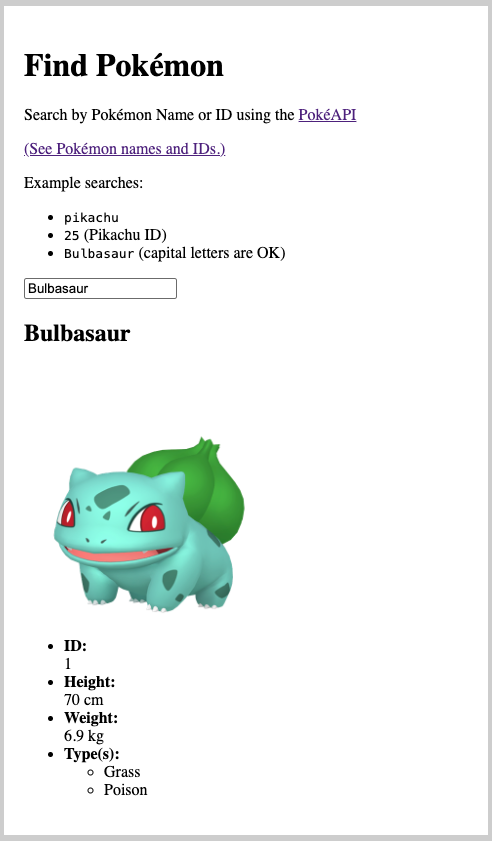

# Display a Pokemon by ID or Name using React

This React app uses the [PokéAPI](https://pokeapi.co/docs/v2#pokemon) to display a pokemon by ID or name from a text input at:  
[https://hollyw00d.github.io/pokemon-api-with-react/](https://hollyw00d.github.io/pokemon-api-with-react/)

Below is a screenshot of searching for `Bulbasaur`:  

